# Session 03: Authentication System Implementation

**Datum:** 06.11.2025
**Dauer:** ~60 Minuten
**Status:** ✅ Abgeschlossen

---

## 🎯 Übersicht

In dieser Session wurde ein vollständiges **Authentication-System** mit Supabase Auth implementiert. Das System ermöglicht Login, Signup, geschützte Routen und Session-Management.

---

## 📋 Implementierte Features

### 1. **Supabase Auth Helper-Funktionen** (`/lib/auth.ts`)

Zentrale Auth-Funktionen für die gesamte App:

- **`signUp(email, password, name)`** – Registriert neue User
- **`signIn(email, password)`** – Loggt User ein
- **`signOut()`** – Loggt User aus
- **`getSession()`** – Holt aktuelle Session
- **`getCurrentUser()`** – Holt aktuellen User
- **`onAuthStateChange(callback)`** – Subscribe zu Auth-Events

**Typen:**
```typescript
interface User {
  id: string;
  email: string;
  name?: string;
  created_at: string;
}

interface AuthResponse {
  user: User | null;
  error: AuthError | null;
}
```

---

### 2. **Auth Context & Provider** (`/contexts/AuthContext.tsx`)

React Context für globales State-Management:

```typescript
interface AuthContextType {
  user: User | null;
  loading: boolean;
  signOut: () => Promise<void>;
}
```

**Features:**
- Automatisches Laden der Session beim App-Start
- Subscribe zu Auth-State-Changes (Login/Logout-Events)
- Loading-State während Auth-Check
- Global verfügbar via `useAuth()` Hook

**Nutzung:**
```tsx
const { user, loading, signOut } = useAuth();
```

---

### 3. **Protected Route Component** (`/components/ProtectedRoute.tsx`)

Wrapper-Component für geschützte Routen:

**Funktionsweise:**
1. Checkt ob User eingeloggt ist
2. Zeigt Loading-Screen während Auth-Check
3. Redirected zu `/?login=true` wenn nicht eingeloggt
4. Rendert Children nur wenn authenticated

**Verwendung:**
```tsx
<ProtectedRoute>
  <DashboardLayout>{children}</DashboardLayout>
</ProtectedRoute>
```

---

### 4. **Updated Auth Modals** (`/components/AuthModals.tsx`)

Erweiterte Login/Signup-Modals mit echter Authentifizierung:

#### **Login-Modal:**
- Email + Password Input
- Error-Anzeige für fehlgeschlagene Logins
- Loading-State während Login
- Redirect zu `/dashboard` nach erfolgreichem Login

#### **Signup-Modal:**
- Name + Email + Password Input
- Passwort-Validierung (min. 8 Zeichen)
- Error-Anzeige
- Loading-State
- Redirect zu `/pricing` nach Signup

**Error-Handling:**
```tsx
{loginError && (
  <div className="mb-4 p-3 bg-red-50 border border-red-200 rounded-lg text-red-600 text-sm">
    {loginError}
  </div>
)}
```

---

### 5. **Dashboard mit Auth** (`/components/dashboard/DashboardLayout.tsx`)

**Änderungen:**
- Wrapped in `<ProtectedRoute>`
- Zeigt aktuellen User (Name/Email)
- Dynamischer Avatar-Buchstabe (erster Buchstabe von Name/Email)
- Logout-Button

**User-Profil-Anzeige:**
```tsx
<div className="flex items-center mb-3">
  <div className="w-10 h-10 bg-accent rounded-full">
    {user?.name?.charAt(0).toUpperCase() || 'A'}
  </div>
  <div className="ml-3">
    <p className="font-medium">{user?.name || 'Artist'}</p>
    <p className="text-xs text-text-secondary">{user?.email}</p>
  </div>
</div>
<button onClick={handleSignOut}>Ausloggen</button>
```

---

### 6. **Auto-Login-Modal bei Protected Route Redirect** (`/app/page.tsx`)

Wenn User auf geschützte Route zugreift ohne eingeloggt zu sein:
1. Redirect zu `/?login=true`
2. Login-Modal öffnet sich automatisch
3. Nach Login: Weiterleitung zu Dashboard

**Implementierung:**
```tsx
useEffect(() => {
  if (searchParams?.get('login') === 'true') {
    setIsLoginOpen(true);
  }
}, [searchParams]);
```

---

## 🗂️ Dateistruktur

```
/lib
  auth.ts                                  # Auth Helper-Funktionen

/contexts
  AuthContext.tsx                          # Auth Provider & Context

/components
  ProtectedRoute.tsx                       # Protected Route Wrapper
  AuthModals.tsx                           # Login/Signup Modals (updated)
  /dashboard
    DashboardLayout.tsx                    # Dashboard mit Logout (updated)

/app
  layout.tsx                               # Root Layout mit AuthProvider (updated)
  page.tsx                                 # Homepage mit Auto-Login-Modal (updated)
  /dashboard
    page.tsx                               # Protected Dashboard Page

/docs
  session-03-authentication.md             # Diese Dokumentation
```

---

## 🎨 User Flow

### **1. Neuer User (Signup)**


### **2. Bestehender User (Login)**


### **3. Zugriff auf geschützte Route**

```mermaid
graph LR
A[User besucht /dashboard] --> B{Eingeloggt?}
B -->|Nein| C[Redirect zu /?login=true]
C --> D[Login Modal öffnet automatisch]
D --> E[Login]
E --> F[Redirect zu /dashboard]
B -->|Ja| G[Dashboard wird angezeigt]
```


### **4. Logout**


---

## 🔧 Technische Details

### **Supabase Client Konfiguration** (`/lib/supabase.ts`)

```typescript
const supabaseUrl = process.env.NEXT_PUBLIC_SUPABASE_URL || 'https://placeholder.supabase.co';
const supabaseAnonKey = process.env.NEXT_PUBLIC_SUPABASE_ANON_KEY || 'placeholder-key';

// Warnung nur in Development
if (typeof window !== 'undefined' && process.env.NODE_ENV === 'development') {
  if (!process.env.NEXT_PUBLIC_SUPABASE_URL || !process.env.NEXT_PUBLIC_SUPABASE_ANON_KEY) {
    console.warn('⚠️ Supabase environment variables are not configured');
  }
}

export const supabase = createClient(supabaseUrl, supabaseAnonKey);
```

**Warum Fallback-Werte?**
- Ermöglicht Build ohne Supabase Credentials
- Production-Warning wenn Credentials fehlen
- Verhindert Build-Errors

---

## 📝 Setup-Anleitung für Supabase

Um das Auth-System zu nutzen, musst du Supabase konfigurieren:

### **1. Supabase Projekt erstellen**
1. Gehe zu https://supabase.com
2. Erstelle ein neues Projekt
3. Wähle Region (Frankfurt/EU empfohlen)
4. Warte bis Projekt bereit ist

### **2. Environment Variables einrichten**

Erstelle eine `.env.local` Datei im Root:

```env
# Supabase
NEXT_PUBLIC_SUPABASE_URL="https://your-project.supabase.co"
NEXT_PUBLIC_SUPABASE_ANON_KEY="your-anon-key"
```

**Wo findest du die Werte?**
1. Supabase Dashboard → Settings → API
2. **URL:** Project URL
3. **Anon Key:** `anon` / `public` key (nicht `service_role`!)

### **3. Email Auth aktivieren**

Supabase Dashboard → Authentication → Providers:
1. **Email** aktivieren
2. **Confirm email** optional deaktivieren (für Development)
3. **Secure password change** aktivieren

### **4. Email Templates anpassen (Optional)**

Supabase Dashboard → Authentication → Email Templates:
- Confirmation Email (Signup)
- Reset Password Email
- Magic Link Email

---

## 🚀 Build & Test

### **Build erfolgreich:**
```bash
npm run build
# ✓ Generating static pages (23/23)
# Build completed successfully
```

### **Testen:**

1. **Dev-Server starten:**
```bash
npm run dev
```

2. **Signup testen:**
   - Klicke auf "Sign up"
   - Email + Password eingeben
   - → Redirect zu `/pricing`

3. **Login testen:**
   - Klicke auf "Log in"
   - Credentials eingeben
   - → Redirect zu `/dashboard`

4. **Protected Route testen:**
   - Besuche `/dashboard` ohne Login
   - → Redirect zu `/?login=true`
   - → Login-Modal öffnet automatisch

5. **Logout testen:**
   - Im Dashboard → "Ausloggen" klicken
   - → Redirect zu `/`

---

## 🐛 Bekannte Probleme & Lösungen

### **Problem 1: "Missing Supabase environment variables"**
**Lösung:** `.env.local` Datei erstellen (siehe Setup-Anleitung oben)

### **Problem 2: "useSearchParams() should be wrapped in a suspense boundary"**
**Lösung:** ✅ Bereits gefixed durch Suspense Wrapper in `app/page.tsx`

### **Problem 3: Login funktioniert nicht (Invalid credentials)**
**Mögliche Ursachen:**
- Falsches Passwort
- User existiert noch nicht (zuerst Sign up)
- Supabase Email Confirmation erforderlich (in Settings deaktivieren für Dev)

---

## 🎓 Lessons Learned

1. **Next.js 15 Suspense Boundaries:** `useSearchParams()` braucht Suspense Wrapper
2. **Build-Zeit vs. Runtime:** Environment Variables nur zur Runtime verfügbar → Fallback-Werte für Build
3. **Protected Routes:** Client-Side Check mit Redirect (keine Middleware, da Client Components)
4. **Auth State Management:** Context + Supabase Auth Listener für globalen State

---

## 📊 Code-Statistiken

**Neue/Geänderte Dateien:**
- **5 neue** Dateien:
  - `lib/auth.ts` (180 Zeilen)
  - `contexts/AuthContext.tsx` (48 Zeilen)
  - `components/ProtectedRoute.tsx` (39 Zeilen)
  - `docs/session-03-authentication.md` (diese Datei)

- **4 geänderte** Dateien:
  - `app/layout.tsx` (+3 Zeilen)
  - `app/page.tsx` (+12 Zeilen)
  - `components/AuthModals.tsx` (+40 Zeilen)
  - `components/dashboard/DashboardLayout.tsx` (+25 Zeilen)
  - `lib/supabase.ts` (Error Handling verbessert)

---

## 🔜 Nächste Schritte (Roadmap)

### **Phase 1: Email Verification**
- [ ] Email-Bestätigungs-Flow
- [ ] Resend Confirmation Email
- [ ] Email Templates anpassen

### **Phase 2: Password Reset**
- [ ] "Passwort vergessen"-Link
- [ ] Reset-Email senden
- [ ] Password-Reset-Page

### **Phase 3: Social Login**
- [ ] Google OAuth
- [ ] GitHub OAuth
- [ ] Spotify OAuth (später für Analytics-Integration)

### **Phase 4: User Profile**
- [ ] Profil-Page (`/dashboard/settings`)
- [ ] Name/Email ändern
- [ ] Passwort ändern
- [ ] Avatar hochladen

### **Phase 5: Role-Based Access**
- [ ] User Roles (Artist / Manager / Label)
- [ ] Permissions-System
- [ ] Team-Mitglieder einladen

---

## ✅ Testing Checklist

- [x] User kann sich registrieren
- [x] User kann sich einloggen
- [x] User wird zu Dashboard redirected nach Login
- [x] Dashboard ist geschützt (ohne Login nicht erreichbar)
- [x] User wird zu `/?login=true` redirected bei unauth. Zugriff
- [x] Login-Modal öffnet automatisch bei `?login=true`
- [x] User kann sich ausloggen
- [x] User-Daten werden im Dashboard angezeigt (Name/Email)
- [x] Build funktioniert ohne Errors
- [x] Loading-States werden angezeigt

---

## 📞 Troubleshooting

**Dev-Server zeigt Warning: "Supabase environment variables are not configured"**
→ Normal, wenn keine `.env.local` Datei existiert. Folge Setup-Anleitung oben.

**Login schlägt fehl ohne Error-Message**
→ Browser Console öffnen (F12) → Netzwerk-Tab → Requests checken

**Protected Route redirect loop**
→ Cookies checken (Application Tab in DevTools) → Supabase Session sollte vorhanden sein

---

**🎉 Session erfolgreich abgeschlossen!**

**Nächster Schritt:** Supabase Projekt erstellen und Environment Variables setzen, dann Live-Test durchführen.
